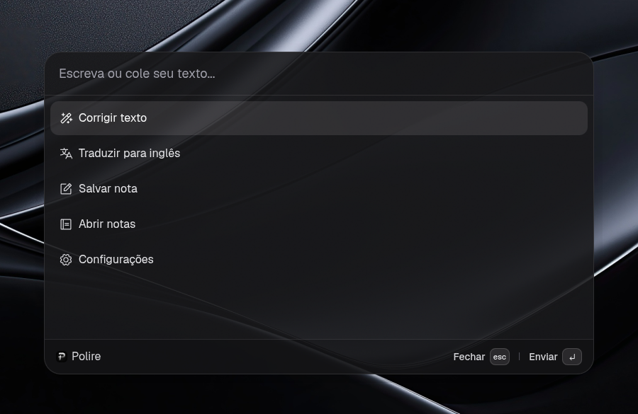

<p align="center">
  
</p>

<h1 align="center">Polire</h1>

<p align="center">Open-source desktop writing assistant for clearer writing, translation, and quick notes.</p>

[](LICENSE)
[](#status)

Polire is a small desktop app for people who write in a non-native language, or simply want to polish text without breaking their flow. Open it from anywhere with a global shortcut, paste or write text, then correct it, translate it, or save it as a local note.



## Status

Polire is under active development. The app currently runs from source and is not yet distributed as a downloadable installer.

## Features

- Improve grammar, spelling, and clarity with a before-and-after result view.
- Translate text to English using your selected AI provider.
- Save quick notes locally and edit them inside the app.
- Bring the palette up from anywhere with `Ctrl+Alt+P`.
- Keep the app out of the way in the system tray.
- Choose between OpenAI, Anthropic, Google Gemini, and DeepSeek.
- Configure your own API key locally instead of relying on a hosted Polire account.
- Use light and dark themes.

## Local-first AI

The open-source version uses a bring-your-own-key model:

- Your provider choice and API key are configured in the app.
- API keys are encrypted locally using Electron's OS-backed secure storage support.
- AI requests are executed by the desktop app against the provider you selected.
- Polire does not currently run a server that receives your text or stores your notes.

When you use an AI action, the submitted text is sent to the selected AI provider according to that provider's policies.

## Notes

Notes are saved locally as Markdown files with stable IDs. This keeps the local format simple and leaves room for optional synchronization features in a future version.

## Development

### Requirements

- [Bun](https://bun.sh/) `>= 1.3`
- Windows or Linux
- Linux: an X11 session is recommended because global shortcut support on Wayland is limited.

### Run locally

```bash
bun install
bun run dev
```

### Validate a build

```bash
bun run format
bun run build
```

`bun run build` type-checks and creates renderer and Electron bundles in `dist/` and `dist-electron/`. Packaging and downloadable installers are not configured yet.

## Default Shortcuts

| Shortcut     | Action                          |
| ------------ | ------------------------------- |
| `Ctrl+Alt+P` | Toggle the palette globally     |
| `Esc`        | Hide the palette when focused   |
| `Backspace`  | Go back outside text fields     |
| `Ctrl+Del`   | Delete the selected local note  |

## Roadmap

- Package signed desktop releases for supported platforms.
- Polish AI configuration and error handling.
- Validate the local-first open-source workflow with early users.
- Explore optional paid sync and online storage separately from the local app.

## Stack

Polire is built with Electron, React, TypeScript, Tailwind CSS, Vite, Bun, and the AI SDK.

## Contributing

The project is early, but bug reports and focused improvements are welcome through GitHub issues and pull requests.

## License

Polire is available under the [MIT License](LICENSE).
