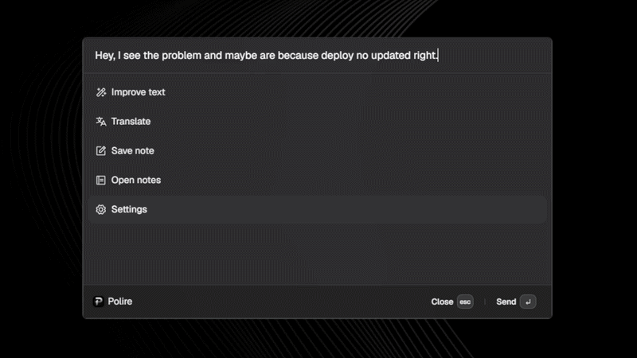

<p align="center">
  
</p>

<h1 align="center">Polire</h1>

<p align="center">Assistente desktop open source para escrever com mais clareza, traduzir textos e salvar notas rápidas.</p>

<p align="center">
  <a href="../README.md">English</a> |
  Português (Brasil) |
  <a href="README.es.md">Español</a>
</p>

[](../LICENSE)
[](https://github.com/joao-gugel/polire/releases/tag/v0.1.0)
[](#download)

O Polire é um pequeno aplicativo desktop para pessoas que escrevem em um idioma não nativo, ou que simplesmente querem aprimorar um texto sem interromper seu fluxo. Abra-o de qualquer lugar com um atalho global, cole ou escreva um texto e então corrija, traduza ou salve-o como uma nota local.



## Download

O Polire `v0.1.0` está disponível para Windows e Linux.

| Plataforma | Download | Atualização automática | Observações |
| ---------- | -------- | ---------------------- | ----------- |
| Windows x64 | [Instalador `.exe`](https://github.com/joao-gugel/polire/releases/download/v0.1.0/Polire-Setup-0.1.0-x64.exe) | Sim | Inicia com o Windows após a instalação; atualmente sem assinatura digital. |
| Linux x64 (AppImage) | [`.AppImage`](https://github.com/joao-gugel/polire/releases) | Sim | Executável único; recomendado para receber atualizações. |
| Linux x64 (Debian/Ubuntu) | [Pacote `.deb`](https://github.com/joao-gugel/polire/releases/download/v0.1.0/Polire-0.1.0-amd64.deb) | Não (manual) | As atualizações devem ser instaladas manualmente com um novo `.deb`. |

Todas as versões publicadas e notas de lançamento estão disponíveis na [página de Releases](https://github.com/joao-gugel/polire/releases).

### Instalação no Linux

Após baixar o pacote Debian:

```bash
sudo apt install ./Polire-0.1.0-amd64.deb
```

A versão para Windows ainda não é assinada digitalmente, portanto o Windows pode exibir um aviso de editor desconhecido durante a instalação.

## Recursos

- Melhore gramática, ortografia e clareza com uma visualização de antes e depois.
- Traduza textos para inglês usando o provedor de IA selecionado.
- Salve notas rápidas localmente e edite-as dentro do aplicativo.
- Abra a paleta de qualquer lugar com `Ctrl+Alt+P`.
- Mantenha o aplicativo discreto na bandeja do sistema.
- Inicie o Polire na bandeja do sistema ao entrar no Windows.
- Escolha entre OpenAI, Anthropic, Google Gemini e DeepSeek.
- Configure sua própria chave de API localmente, sem depender de uma conta hospedada do Polire.
- Use temas claro e escuro.

## IA local-first

A versão open source usa o modelo em que você fornece sua própria chave:

- O provedor e a chave de API são configurados no aplicativo.
- As chaves de API são criptografadas localmente usando o armazenamento seguro suportado pelo Electron e pelo sistema operacional.
- As requisições de IA são executadas pelo aplicativo desktop contra o provedor selecionado.
- Atualmente, o Polire não mantém um servidor que receba seus textos ou armazene suas notas.

Ao usar uma ação de IA, o texto enviado será encaminhado ao provedor de IA selecionado, de acordo com as políticas desse provedor.

## Notas

As notas são salvas localmente como arquivos Markdown com IDs estáveis. Isso mantém o formato local simples e permite considerar recursos opcionais de sincronização em uma versão futura.

## Desenvolvimento

### Requisitos

- [Bun](https://bun.sh/) `>= 1.3`
- Windows ou Linux
- Linux: recomenda-se uma sessão X11, pois o suporte a atalhos globais no Wayland é limitado.

### Executar localmente

```bash
bun install
bun run dev
```

### Validar um build

```bash
bun run format
bun run test
bun run build
```

`bun run test` executa testes unitários e de componentes React com Bun. `bun run build` realiza a checagem de tipos e cria os bundles do renderer e do Electron em `dist/` e `dist-electron/`.

### Empacotar localmente

```bash
bun run package:linux         # AppImage + .deb em release/
bun run package:win           # NSIS .exe em release/
bun run package:linux:flatpak # .flatpak (requer flatpak + flatpak-builder)
```

Gere o instalador do Windows no Windows; o GitHub Actions cuida dos dois sistemas operacionais para releases com tag.

### Publicar uma versão

O workflow de release gera os instaladores e cria uma GitHub Release quando uma tag de versão é enviada. A tag deve corresponder à versão em `package.json`.

```bash
git tag v0.1.1
git push origin v0.1.1
```

Atualize `package.json` para a versão correspondente antes de criar uma nova tag. As versões para Windows ainda não são assinadas digitalmente.

### Atualização automática

O Polire inclui o [`electron-updater`](https://www.electron.build/auto-update) integrado às GitHub Releases. Durante a execução, o aplicativo consulta o feed de releases ao iniciar e a cada quatro horas, baixa novas versões em segundo plano e as aplica ao sair (uma notificação do sistema confirma quando a atualização está pronta).

Por plataforma:

- **Windows (NSIS)**: suporte completo. O novo instalador é baixado, verificado por hash e aplicado silenciosamente quando o aplicativo é fechado. Instalações não assinadas acionam o SmartScreen na primeira instalação, mas atualizações posteriores permanecem discretas.
- **Linux AppImage**: suporte completo. O AppImage substitui a si próprio; o usuário precisa apenas reabrir o aplicativo.
- **Linux `.deb`**: sem atualização automática (limitação do `electron-updater`). Os usuários precisam baixar e instalar manualmente novas versões `.deb`.
- **Linux Flatpak**: não é atualizado pelo `electron-updater`. Distribua via Flathub; o runtime do Flatpak gerencia atualizações na máquina do usuário.

Para a atualização automática funcionar, cada GitHub Release deve incluir os arquivos de metadados `latest.yml` (Windows) e `latest-linux.yml` (Linux) junto aos instaladores. O workflow de release faz isso automaticamente; ao publicar manualmente, execute `electron-builder --publish always` com `GH_TOKEN` definido.

## Atalhos padrão

| Atalho       | Ação                                  |
| ------------ | ------------------------------------- |
| `Ctrl+Alt+P` | Alternar a paleta globalmente         |
| `Esc`        | Ocultar a paleta quando estiver ativa |
| `Backspace`  | Voltar fora de campos de texto        |
| `Ctrl+Del`   | Excluir a nota local selecionada      |

## Roadmap

- Assinar digitalmente as versões para Windows e simplificar as atualizações.
- Aprimorar a configuração de IA e o tratamento de erros.
- Explorar sincronização paga opcional e armazenamento online separadamente do aplicativo local.

## Stack

O Polire é construído com Electron, React, TypeScript, Tailwind CSS, Vite, Bun e AI SDK.

## Contribuindo

Relatos de bugs e melhorias focadas são bem-vindos por meio de issues e pull requests no GitHub.

## Licença

O Polire está disponível sob a [Licença MIT](../LICENSE).
